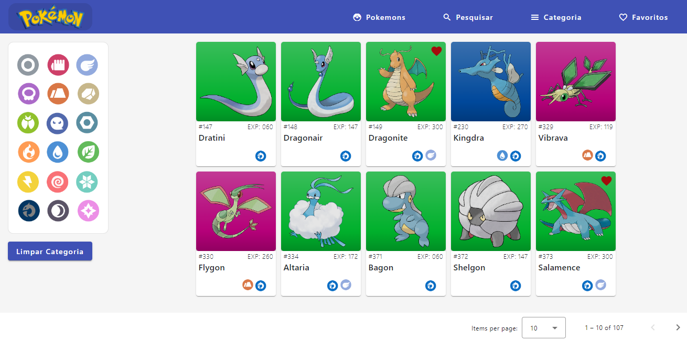

# angular-pokeapi
<div style="text-align: justify">

### Descrição do Projeto
> - *Acesso ao Aplicativo:* https://angular-pokeapi.web.app 

<p>Este é um projeto de uma aplicação web feita em Angular para consumir a PokeAPI. Ele oferece uma variedade de funcionalidades para os entusiastas de Pokémon, permitindo explorar uma vasta coleção de informações sobre essas criaturas adoráveis.</p>

<p>Este projeto foi criado como parte dos meus estudos em Angular. Durante o desenvolvimento, percebi que em projetos anteriores com Angular, cometi alguns erros e padrões incorretos de codificação. Neste projeto, foquei em corrigir esses erros identificados por mim, bem como implementar melhorias para seguir boas práticas de desenvolvimento.</p>

### Tecnologias Utilizadas
- ***Angular:*** Framework utilizado para o desenvolvimento do aplicativo web.
- ***SCSS:*** O Sassy CSS foi utilizado para a estilização do projeto de forma mais eficaz.
- ***TypeScript:*** Um superset de JavaScript utilizado para escrever toda a parte logica da aplicação.
- ***PokeApi:*** Uma Api publica que fornece dados de centenas de pokemons.
- ***Google FireBase:*** Hospedagem do aplicativo.

### Funcionalidades
- *Tela Geral de Pokemons*
- *Cards Individuais*
- *Pesquisa por Nomes*
- *Pesquisa por Categoria de Tipo*
- *Opção de Favoritar Pokemons*

## Executando o Projeto
- **Clone o repositório:** Utilize o comando abaixo para clonar este repositório em sua máquina local:
```typescript
    git clone https://github.com/Dan1elz/angular-pokeapi.git
```

- **Instale as dependências:** Após clonar o repositório, navegue até o diretório do projeto e instale as dependências utilizando o comando:
```typescript
    cd angular-pokeapi
    npm install
```
- **Inicie o servidor de desenvolvimento:** Use o comando abaixo para iniciar o servidor de desenvolvimento:
```typescript
    ng serve
    http://localhost:4200
```
###### Certifique-se de ter o Angular CLI instalado globalmente (npm install -g @angular/cli) para poder usar os comandos acima.

## Imagens do Projeto





## Contribuindo
<p>Contribuições são bem-vindas! Se você encontrar um problema ou desejar aprimorar este projeto, sinta-se à vontade para abrir uma issue ou enviar um pull request. Vamos Evoluir Juntos!</p>
